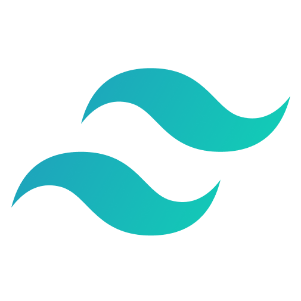

# Contract Analysis System

## Overview

The Contract Analysis System is a solution tailored for financial analysts and accountants to efficiently manage and analyze contract documents. By allowing users to seamlessly upload contract files, the application leverages advanced AI-driven pipelines to automatically extract essential fields. These extracted fields are then displayed in an organized and comprehensive table, facilitating easy review, analysis and simultaneously stored in SQLite database. Additionally, users have the convenient option to download the extracted data in Excel format for further manipulation and record-keeping. The system's robust architecture ensures accurate data extraction through its integrated frontend and backend components, providing a seamless and reliable user experience.

## Installation

### Clone the Repository

To set up the application locally, first clone the repository:

```bash
git clone https://github.com/Prajwal-0-ak/contract.git
cd contract
```

### Set Up Environment Variables

Create a `.env` file in the root directory and add your API keys:

```plaintext
OPENAI_API_KEY=your-openai-api-key
GROQ_API_KEY=your-groq-api-key
```

### Create Virtual Environment

Create a virtual environment using Python 3:

```bash
python3 -m venv venv
source venv/bin/activate 

# For Windows
venv\Scripts\activate
```

### Install Dependencies
In the root directory, install the required dependencies:
  
  ```bash
  pip install -r requirements.txt
  ```

##### Frontend:

```bash
cd frontend
npm install
```

### Running the Application

#### Start Backend Services:

##### RAG Pipeline:

```bash
cd rag_pipeline
uvicorn app.main:app --host 0.0.0.0 --port 8000
```

##### Fuzzy Pipeline:

```bash
cd fuzzy_pipeline
uvicorn main:app --host 0.0.0.0 --port 8080
```

#### Start Frontend:

```bash
cd frontend
npm run dev
```

### Using Docker

Alternatively, you can run the entire application using Docker:

Pull the Docker image:

```bash
docker pull akprajwal/contract_app
```


```bash
docker run \
  -p 3000:3000 \
  -p 8000:8000 \
  -p 8080:8080 \
  -e OPENAI_API_KEY="your-openai-api-key" \
  -e GROQ_API_KEY="your-groq-api-key" \
  contract
```

*Replace your-openai-api-key and your-groq-api-key with your actual API keys.*

## Directory Structure

The project has the following structure:

```
.
├── .env
├── .gitignore
├── Dockerfile
├── frontend/
│   ├── app/
│   ├── components/
│   ├── public/
│   ├── package.json
│   └── ...
├── fuzzy_pipeline/
│   ├── config.yaml
│   ├── contract_files/
│   ├── main.py
│   ├── tests/
│   └── ...
├── rag_pipeline/
│   ├── app/
│   ├── contract_files/
│   ├── db/
│   ├── tests/
│   └── ...
├── README.md
├── requirements.txt
├── supervisord.conf
└── ...
```

## Tech Stack

<table>
  <tr>
    <td align="center">
      
      <br> React
    </td>
    <td align="center">
      
      <br> Next.js
    </td>
    <td align="center">
      
      <br> TypeScript
    </td>
    <td align="center">
      
      <br> Python
    </td>
    <td align="center">
      
      <br> Docker
    </td>
    <td align="center">
      
      <br> HuggingFace
    </td>
    <td align="center">
      
      <br> FastAPI
    </td>
    <td align="center">
      
      <br> Milvus
    </td>
    <td align="center">
      
      <br> Git
    </td>
    <td align="center">
      
      <br> OpenAI
    </td>
    <td align="center">
      
      <br> SQLite
    </td>
    <td align="center">
      
      <br> Shadcn UI
    </td>
    <td align="center">
      
      <br> Tailwind CSS
    </td>
  </tr>
  
</table>